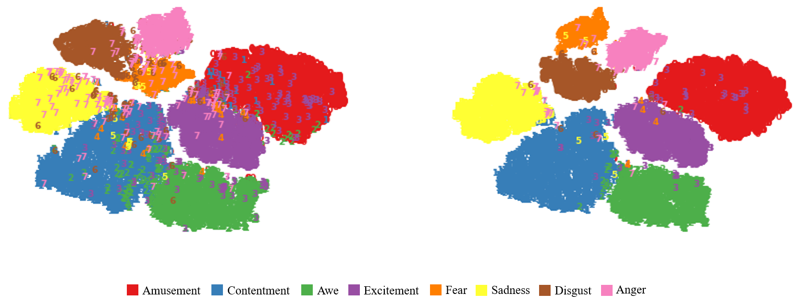

# Visual Sentiment Analysis with Semantic Correlation Enhancement

The Pytorch and MXNet implementation of "Visual Sentiment Analysis with Semantic Correlation Enhancement"

## Framework

Framework of the proposed VSCNet. EAN is designed for visual features, while swin Transformer is used to obtain affective activation regions and convert them to semantic embeddings. Our model considers both visual information and semantics through fusion layers and outputs the final emotion distribution.

## Affective region candidates

Potential affective regions. The swin Transformer is employed to obtain potential affective regions. The candidate regions are encoded into a semantic space through fully connected layers.

## Requirements

You may need to install the package via pip/conda:

* **CUDA = 10.2**
* **Pyrotch >= 1.10**
* **MXNet**
* **d2lzh**
* **Python3**

## Results

Classification performance achieved on **FI dataset**.

| Model         |    FI     | Emotion-6 |
| ------------- | :-------: | --------- |
| PDANet        |   69.42   | 56.90     |
| RA-DLNet      |   72.80   | ——        |
| Stimuli-Aware |   72.42   | 61.62     |
| MLM           |   67.49   | 59.41     |
| MAP           |   66.13   | 60.47     |
| BoT           |   72.60   | 61.43     |
| Ours          | **73.04** | **62.86** |

## Visualization

Visualization of affective feature embeddings. Each point represents an image in FI datasets. Different emotion labels are distinguished by different colors. The left and right plots show the feature space of the FI training set and the entire dataset, respectively. It is observed that our framework can separate the images from different emotion categories more effectively.

## Citation

Hao Zhang, Yanan Liu, Zhaoyu Xiong, Zhichao Wu, Dan Xu. Visual Sentiment Analysis with Semantic Correlation Enhancement[J]. This is a preprint version, 2023.

